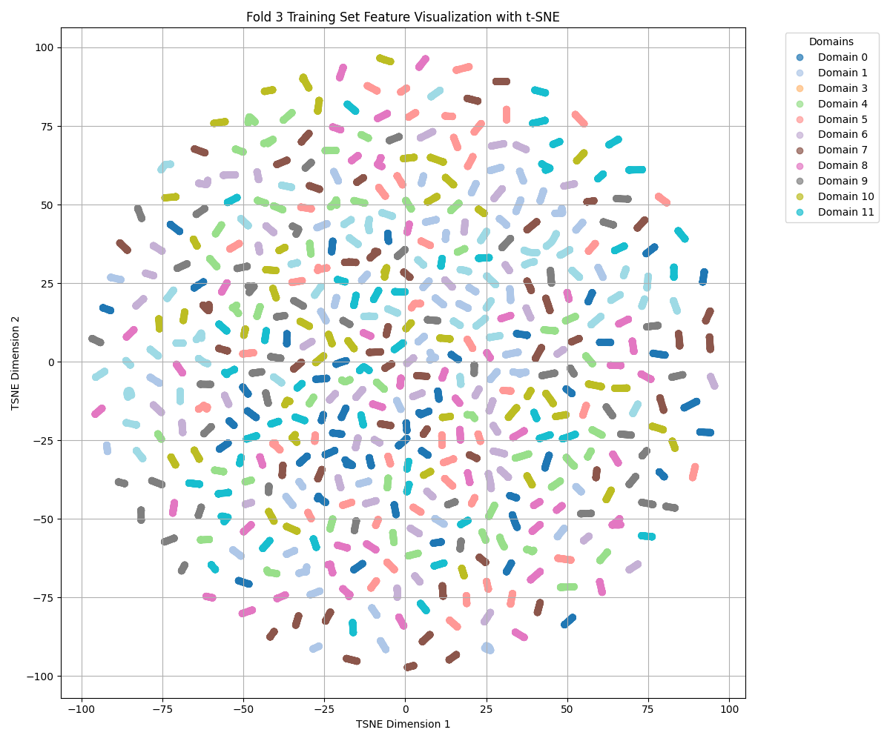
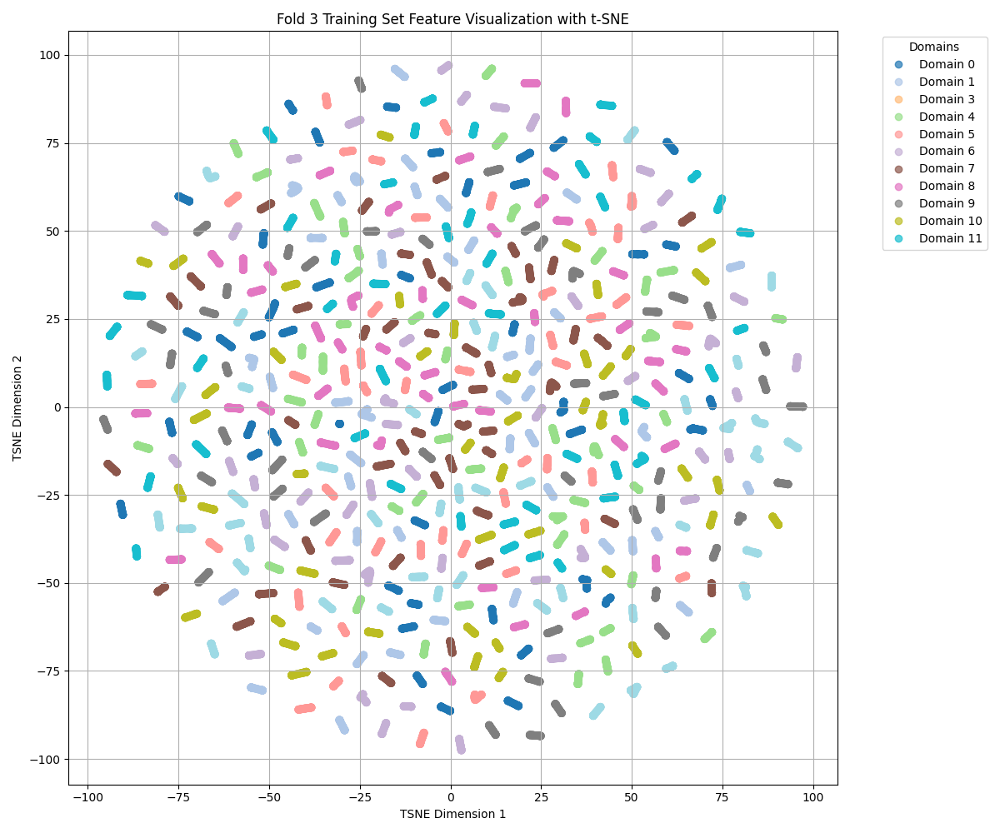

## Homework3实验报告

- 由于本次实验的数据预处理、模型结构与超参数设置都大同小异，并没有太大的区别，因此放在一起进行说明

### 数据预处理

- 为了实现做跨被试留一交叉验证，我使用`LeaveOneGroupOut`进行数据的分组
- 数据读入后需要降维成310维，还需要使用`StandardScaler`对特征进行标准化处理
- 数据转换为`float32`的`pytorch`张量

### 模型结构

- 模型主要包括：梯度反转层（Gradient Reversal Layer, GRL），特征提取器（FeatureExtractor），情感分类器（EmotionClassifier），域分类器（DomainClassifier），域适应/扩散模型主体（DomainAdaptation）。
- 梯度反转层用于前向传播时实现梯度反转
- 特征提取器是一个基于CNN的多层神经网络，具有哪两个卷积层，两个池化层，一个展平层与一个全连接层，最终输出特征维数为256维
- 情感分类器基于提取的特征进行情感类别的预测，有两个全连接层，中间由ReLU函数激活
- 域分类器实现对提取的特征进行域的预测，有两个全连接层，中间由ReLU函数激活
- 域适应/扩散模型为前面的组合，实现联合优化

### 超参数

- 学习率：0.001
- Batch Size：32
- 卷积层：32,64，从小到大学习
- 卷积核：(3, 1)，基于数据维度进行设置
- 提取特征：256维
- 反转层参数：采用 Sigmoid 函数，随着训练进度逐渐增强对抗训练的力度

### 实验结果

#### 域适应

- 平均准确率: 81.66%
- 准确率标准差: 6.44%

#### 域迁移

- 平均准确率: 78.42%
- 准确率标准差: 6.93%

#### 无域判别

- 平均准确率: 78.52%
- 准确率标准差: 7.48%
- 无域判别结果差于域适应， 优于域迁移，但无论是优于还是差于，结果都不显著

### 画图

- 无论是否使用域判别器，被试数据经过特征提取以后，基本接近均匀分布，并不存在聚块

