# Homework 1 报告

## Q1

- 在第一项任务中，我通过将在四个不同的维数中随机选择100个数字，并计算他们之间的距离，从而得出维度灾难的相关结论：随着数据的维度增加，数据在高维空间中的分布越来越稀疏，距离度量失去有效性

- 为了更明显的得出结论，我将每个可视化都设置为从0开始

  

  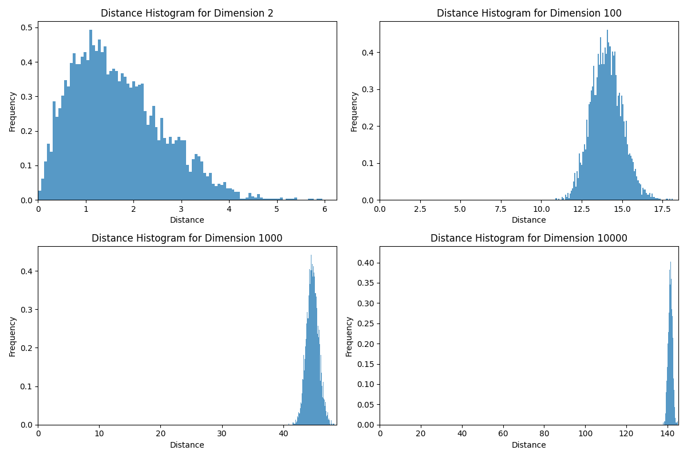

## Q2

### q1

- 三种方法都有现成的库，我只需要调用相关的库并进行数据的处理即可
- 下面给出对被试1的三种降维方法的处理结果

#### PCA

- 对于训练数据PCA可以很好的分出来积极，但对于中性和消极，PCA降维无法将二者区分开来

- 但对于测试数据，PCA可以说是完全不行

  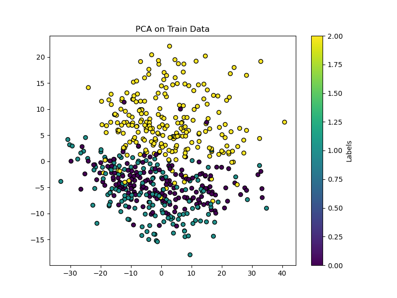 
  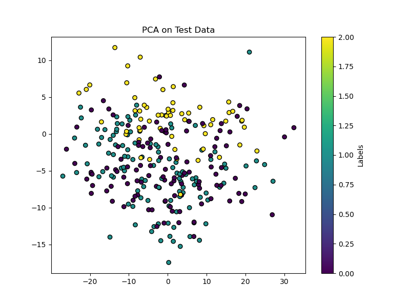

#### LDA

- LDA的效果十分的好，无论是训练数据还是测试数据都可以很好的区分

  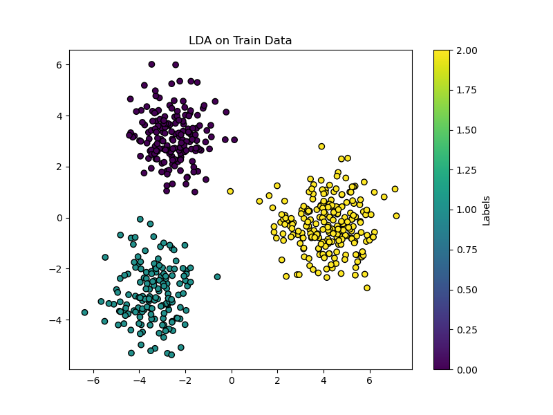 
  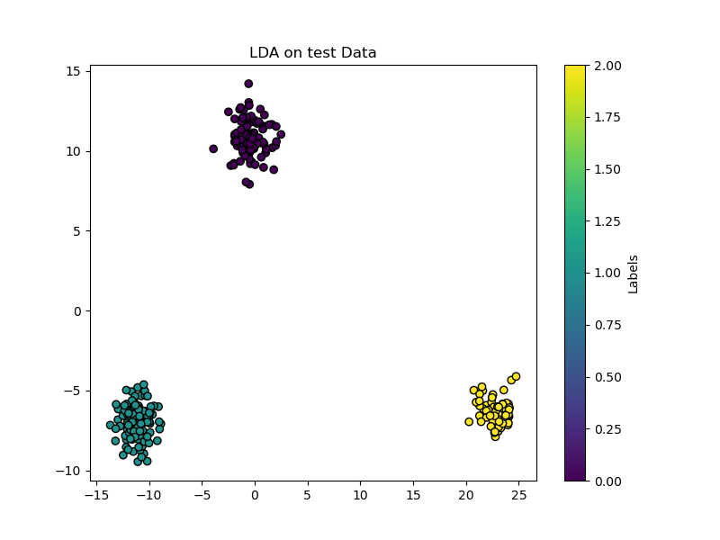

#### TSNE

- TSNE方法，需要进行一定的训练与调参，但我调试了很久都没有找到一个合适的参数进行降维，最后的结果是差于上面两项

  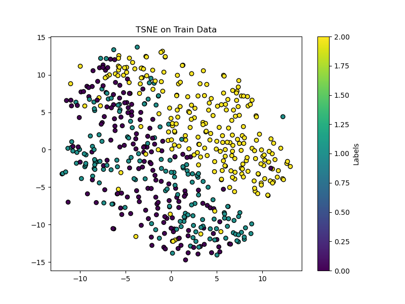 
  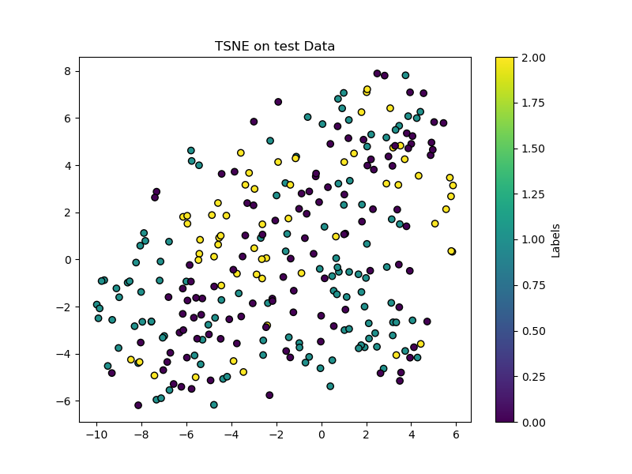

### q2

#### PCA

- 在数据量增大以后，PCA的效果明显下降

  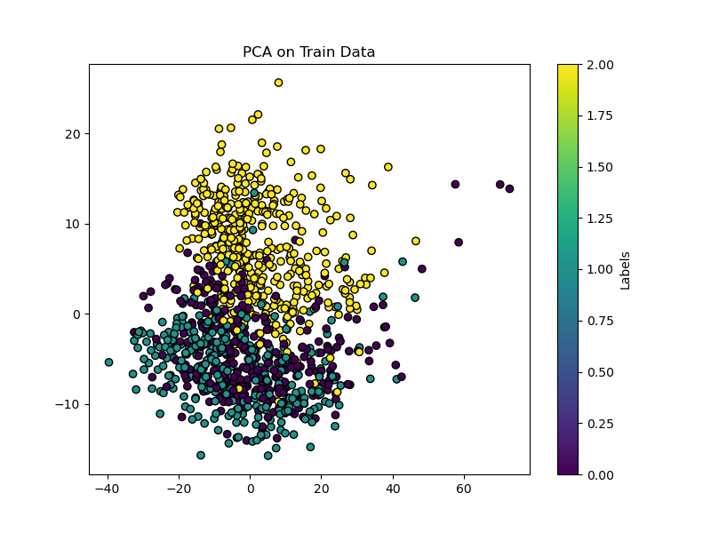 
  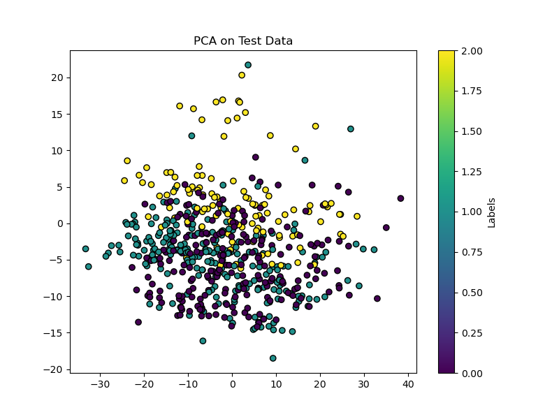

#### LDA

- LDA的效果依旧较好，只是在部分小地方会分不出来
  
   
  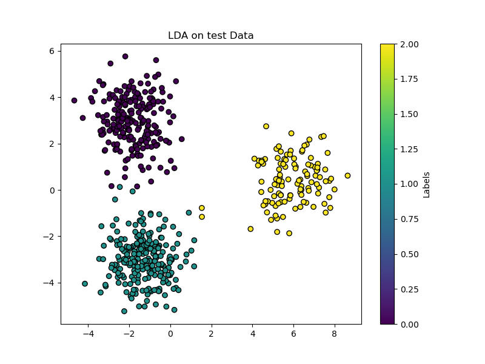

#### TSNE

- TSNE方法，反而使得相同类别的积极情况变得分散看，效果变差了

  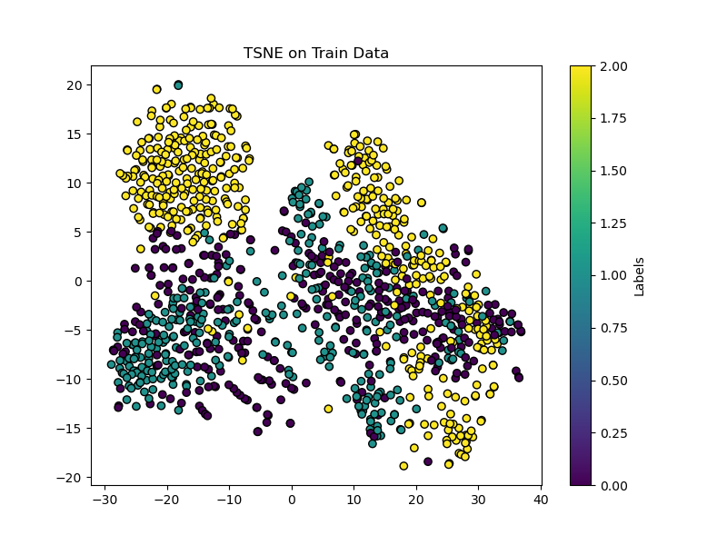 
  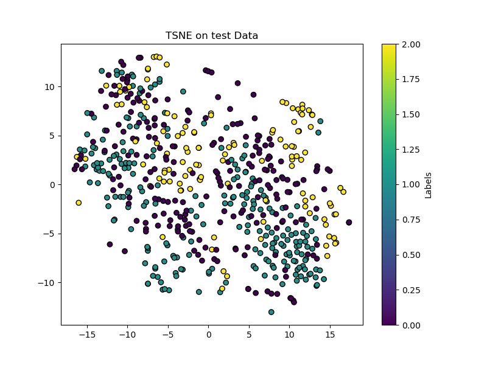

### q3

#### 被试1

- KNN 模型的准确率: 0.8482142857142857
- SVM 模型的准确率: 0.8839285714285714

#### 被试2

- KNN 模型的准确率: 0.7589285714285714
- SVM 模型的准确率: 0.8839285714285714

#### 被试3

- KNN 模型的准确率: 0.7857142857142857
- SVM 模型的准确率: 0.8660714285714286

