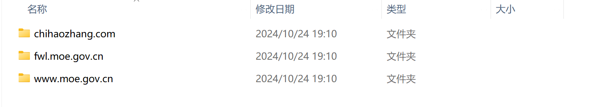

# PROXY REPORT

## 前言

- 本次的`proxy`为使用`socket`编程，针对的协议为`HTTP`与`HTTPS`，其中对于`HTTP`的`GET` 请求设计了本地的缓存处理，对于其他的请求都仅仅进行了转发处理；
- 本地测试使用`ProxySwitchyOmega`浏览器插件，将浏览器的网络代理设置为程序；

## 程序架构

- 程序由四个主要的函数组成
- `Forward`：处理`CONNECT`与`GET`以外的请求
- `GET`：处理`GET`请求
- `CONNECT`：处理`CONNECT`请求
- `handle_client`：对于从浏览器接收的信息进行分流

## 主体思路

- 程序在运行后监听`8080`端口，从浏览器接收到请求之后，按照请求的头将请求进行分流处理；
- 对于`GET`请求，我们先根据链接检查缓存中是否有对应的文件，如果有，直接返回缓存中的文件，如果没有，向服务器请求对应文件，将返回文件存在缓存中并返回给服务器；
- 对于`CONNECT`请求，我们手动向目标服务器建立连接，并转发他们之间的一切信息；
- 对于`POST`以及其他请求，我们直接将对应请求发送到目标服务器即可；

## 任务描述

- 对于基础任务，我实现了针对`HTTP`和`HTTPS`的浏览器代理，且经受过大部分网站的验证

- 对于404错误的处理，我会手动返回`<html><body><h1>404 Not Found</h1></body></html>`使得用户可以在浏览器上收到404的信息

- 对于`POST`请求，由于它并不需要对信息有过多的处理与判断，因此我直接对其建立连接并进行转发

- 对于`cache`，我实现了一个本地的`cache`，以及cache命中时的直接返回

  

- 上图为在访问了很多网站后才找到的几个使用`HTTP`的网站的缓存